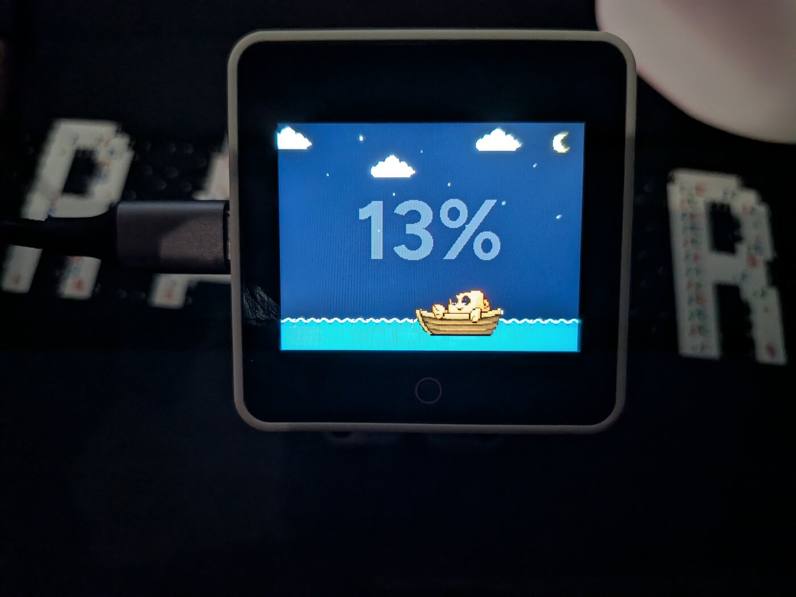
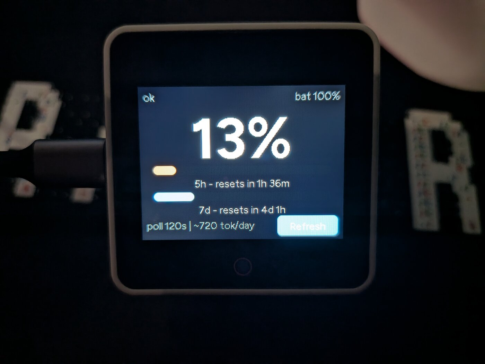
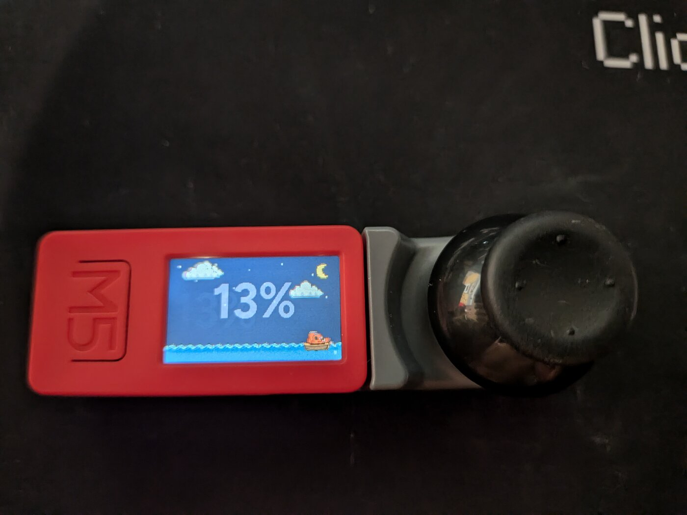
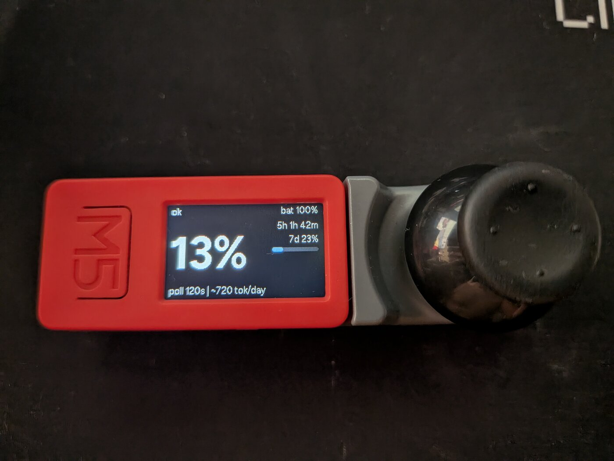

# clawd-bot

<p align="center">
  
</p>

A standalone Claude Code usage monitor for the desk: no host software,
no companion daemon. The device connects to your WiFi and polls Anthropic
directly with a dedicated long-lived token, showing your usage on whatever
screen it has - as readable as that screen allows.

Built as an ESPHome package with per-board implementations over a shared
engine: adopt it from the ESPHome Builder (inside or outside Home
Assistant) with a dozen lines of YAML, update over-the-air by bumping a
release tag, and pick the board entry that matches your hardware.

|  |  |
| :---: | :---: |
|  |  |
| The crab sails a sea that IS your usage | Main screen: readable from across the room |
|  |  |
| M5StickC Plus, minimal UI | Same engine, joystick-hat variant |

## What it shows

- **5-hour window utilization** as a hero number readable from desk distance
- 5h and 7-day bars with reset countdowns
- Status line: limit status, battery, and the polling cost (requests/day)
  so you always know what the monitor itself consumes
- On-screen touch button to force a refresh

## Supported devices

One codebase, per-board implementations: every board gets its own entry
under `boards/` combining the shared usage engine with hardware support
and a UI sized to what the device can do. All boards update the same way
(bump the release tag, flash OTA).

| Board | Import file | Status | UI |
|---|---|---|---|
| [M5Stack CoreS3](https://docs.m5stack.com/en/core/CoreS3) / [Stack-chan](https://docs.m5stack.com/en/StackChan/) | `boards/m5stack-cores3.yaml` | supported | rich 320x240 touch: hero number, bars, countdowns, touch refresh |
| M5Stack CoreS3 SE | `boards/m5stack-cores3.yaml` | untested, should work | same as CoreS3 (no battery gauge) |
| [M5StickC Plus](https://docs.m5stack.com/en/core/m5stickc_plus) | `boards/m5stickc-plus.yaml` | supported, tested on hardware | minimal 240x135: hero number, 7d bar, countdown; front button = refresh |
| M5StickC Plus + [Joystick Hat](https://docs.m5stack.com/en/hat/hat-joystick) | `boards/m5stickc-plus-joy.yaml` | supported | minimal + joystick: press = refresh, Y-axis = brightness |
| M5StickC Plus2 | planned | - | minimal (same UI class) |

Want another board? See [CONTRIBUTING.md](CONTRIBUTING.md) - the layout
is designed for drive-in board additions.

## How it gets the data

Anthropic exposes the unified rate-limit state as response headers on API
calls. clawd-bot sends a minimal ~1-token probe request to `/v1/messages`
with your Claude Code OAuth token and reads
`anthropic-ratelimit-unified-{5h,7d}-{utilization,reset}` from the response.
At the default 120s interval that is ~720 tiny requests/day; the footer
shows the figure for your configured interval.

The token comes from `claude setup-token` (valid one year, scoped to
inference). Treat it like a password: it lives in your ESPHome secrets and
never leaves the device except toward api.anthropic.com over TLS.

## Quick start - ESPHome Builder (Home Assistant or standalone)

1. Generate a token on any machine with Claude Code:

   ```
   claude setup-token
   ```

2. In the Builder's **Secrets** editor add one entry (your WiFi secrets
   are usually already there from the wizard):

   ```yaml
   claude_token: "sk-ant-oat01-..."
   ```

3. Create the device with the **New Device** wizard as usual (pick your
   board or any ESP32-S3 entry - our package overrides what matters).
   The wizard generates a YAML with `esphome:`, `api:`, `ota:`, `wifi:`
   and `captive_portal:` blocks. **Keep all of them**, and paste this at
   the bottom of the file:

   ```yaml
   substitutions:
     claude_token: !secret claude_token
     # poll_interval: "120"   # optional override, seconds

   packages:
     clawd_bot:
       url: https://github.com/eldios/clawd-bot
       ref: stable                            # latest release, auto-updating
       files: [boards/m5stack-cores3.yaml]   # pick your board from the table
       refresh: 1d
   ```

   To use a translated UI, add the language pack to the same list:
   `files: [boards/m5stack-cores3.yaml, lang/it.yaml]`.

4. First install: connect the device over USB and use "Install via USB"
   (or [web.esphome.io](https://web.esphome.io) from any browser).
5. Updates: with `ref: stable` just hit Install - the `stable` branch
   always points at the latest release, and `refresh:` controls how often
   the Builder re-fetches it. Prefer full control? Pin `ref: v0.0.3` and
   bump it yourself per release; `ref: main` rides the bleeding edge.

## Quick start - CLI

```
git clone https://github.com/eldios/clawd-bot
cd clawd-bot
cp secrets.example.yaml secrets.yaml   # fill wifi + claude_token
esphome run clawd-bot.yaml             # first time over USB, then OTA
```

Nix users: `nix develop` provides `esphome` and `esptool`.

## Languages

UI strings default to English. Ready-made packs live in `lang/`
(`it`, `de`, `fr`, `es`): add one to the `files:` list after the board
entry (see Quick start), or override individual `str_*` substitutions
directly in your config (top-level substitutions always win).

## Troubleshooting

**Build fails with an error that was already fixed** (even after "Clean
Build Files"): the Builder caches the git package for the `refresh:`
interval, and cleaning build files does not clear that cache. Set
`refresh: 0s` in the `packages:` block, hit Install once to force a
re-fetch, then restore `refresh: 1d`.

**Compiler warnings from `mipi_spi.cpp` (`-Wempty-body`)**: these come
from ESPHome's own display component, not from clawd-bot - harmless,
safe to ignore.

## Home Assistant integration

The device exposes its sensors natively (5h/7d utilization, limit status,
battery) plus the display settings (dim timeout/brightness, screensaver
enable/timeout/metric) as config entities. Automations like "notify me
at 80% usage" are a two-line HA automation away - no extra firmware work.

**If the device does not appear automatically**: mDNS discovery does not
cross VLANs, so on segmented networks (device on an IoT VLAN, HA
elsewhere) you must add it manually - Settings > Devices & services >
Add integration > ESPHome > host `clawd-bot.local` (or its IP), port
6053. OTA and logs from the ESPHome Builder work either way, since they
use direct routing rather than discovery.

## Roadmap

- Session-reset chime (the CoreS3 speaker + AW88298 amp are supported by
  M5Stack's official ESPHome components already)
- Anthropic status-page indicator
- Stack-chan body features: servo gestures, LEDs, and friends

## Acknowledgements

This project stands on the shoulders of two lovely projects - thank you:

- [claude-usage-stick](https://github.com/oauramos/claude-usage-stick) by
  @oauramos - pioneered the standalone approach and the rate-limit-header
  probe this project uses.
- [Clawdmeter](https://github.com/HermannBjorgvin/Clawdmeter) by
  @HermannBjorgvin - the desk-distance UX this project chases, and the
  proof that a Claude usage meter belongs on every desk.

Hardware support comes from
[M5Stack's official ESPHome components](https://github.com/m5stack/esphome-yaml).

## License

MIT - see [LICENSE](LICENSE).
